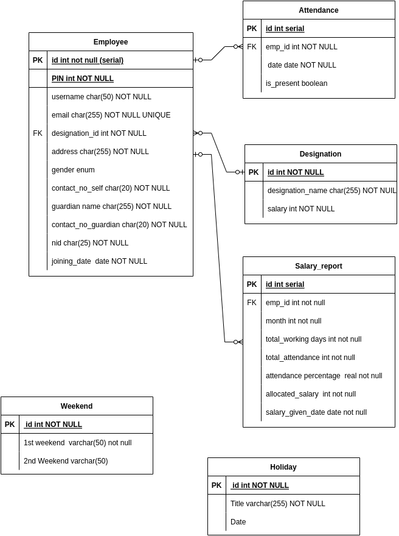
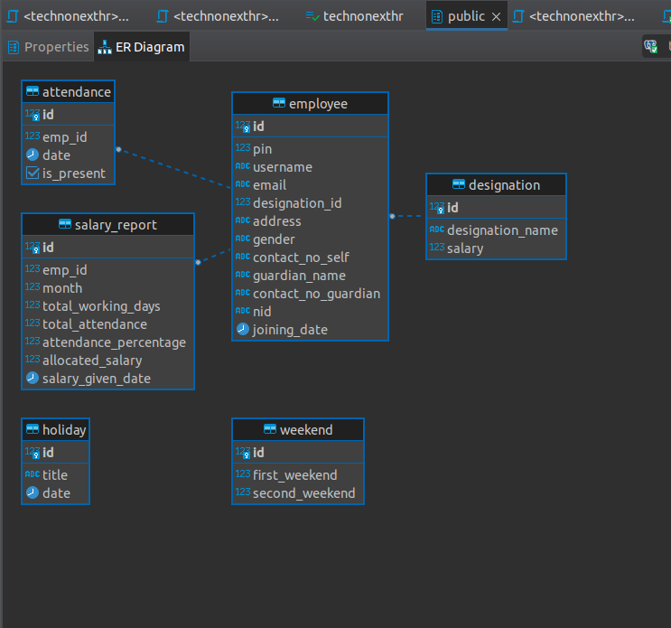

# DB_Exam_TechnoNext
### Problem statement
[question](database_exam.pdf)

### Solution:
* First draw the ER diagram with draw.io 
 

[ER Diagram]

* then create all the tables with create_table.sql
the result of dbeaver generated ER diagram is given below:

Next do all the queries.
